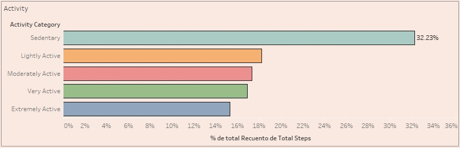
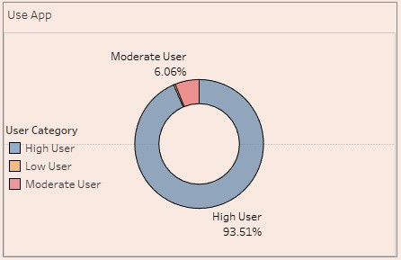
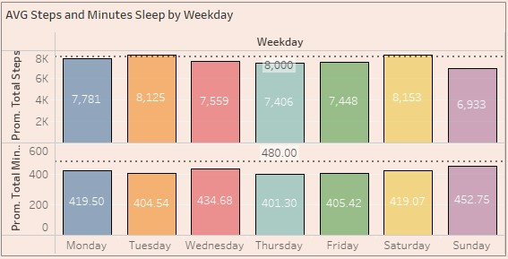
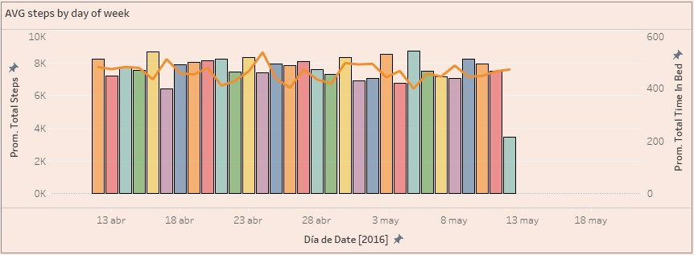
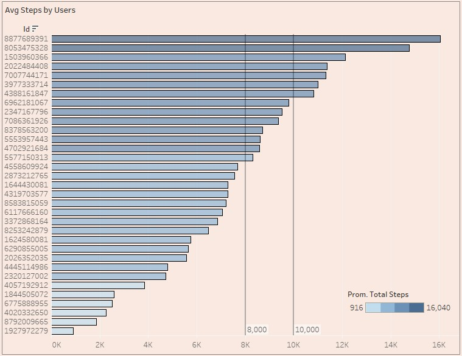
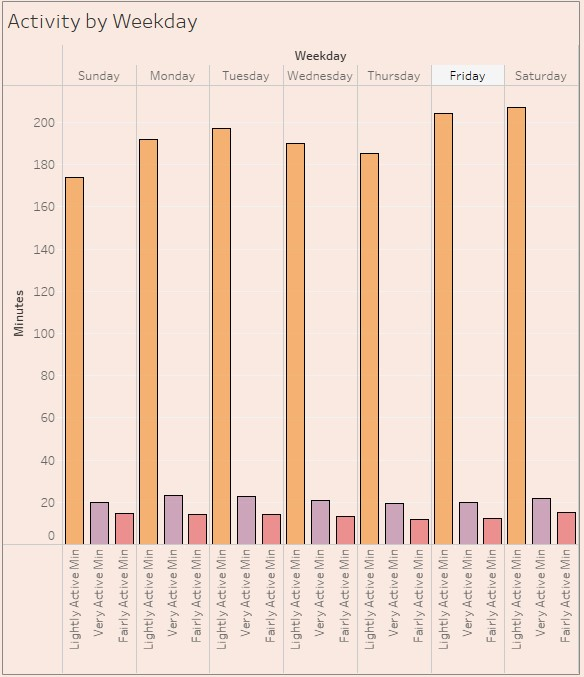

  

# **Bellabeat – Google Data Analytics Capstone**

This project was developed as part of the Google Data Analytics Capstone, with the objective of uncovering insights from smart device usage data to support Bellabeat’s mission of promoting women’s wellness.

The analysis was performed in BigQuery and Tableau, following a structured end-to-end process:

1. [Background Information](#1-background-information)
2. [Data import and preparation](#2-data-import-and-preparation)
3. [Data cleaning and transformation](#3-data-cleaning-and-transformation)
4. [Feature creation and analysis](#4-feature-creation-and-analysis)
5. [Data visualization](#5-data-visualization)

## **1. Background Information**

Bellabeat, a manufacturer of health-focused tech products for women, is a small company with potential to expand in the global smart device market. Co-founder and Chief Creative Officer Urška Sršen believes analyzing activity data from their devices could reveal growth opportunities. The goal of this analysis is to examine the usage of one smart product to gain insights into consumer behavior, which will then guide the company’s marketing strategy.

### Business Task

The objective of this project is to analyze consumer behavior using smart device data to identify actionable insights for Bellabeat. By examining usage patterns and trends from both non-Bellabeat and Bellabeat devices, the analysis aims to uncover opportunities to enhance user engagement and inform marketing strategy. Key deliverables include a detailed assessment of usage trends, visualizations highlighting user behavior, and high-level recommendations to optimize product positioning and marketing initiatives.

### About the Data

The data for this case study comes from the [Fitbit Fitness Tracker Data](https://www.kaggle.com/datasets/arashnic/fitbit), a publicly available dataset on Kaggle. It contains detailed fitness tracker information from 30 Fitbit users, all of whom consented to share their personal tracker data. The dataset will be imported into RStudio for cleaning, filtering, and analysis to extract actionable insights.

### Limitations

* Small sample size: The dataset originally included 30 users, but after cleaning, only 24 had complete records, limiting the ability to generalize findings to the broader smart device consumer population.

* Non-representative users: The sample may not reflect diversity in age, gender, physical activity habits, or geographic location.

* Potential behavior bias: Users who consented to share their data may behave differently from the general population.

* Limited to Fitbit devices: The data comes solely from Fitbit, so trends may not fully apply to other smart devices or Bellabeat products.

* Lack of additional context: The dataset does not include broader demographic or lifestyle variables, restricting analysis of factors influencing device usage.

## **2. Data import and preparation**
Three datasets were initially loaded into the workspace: dailyActivity_merged, sleepDay_merged, and weightLogInfo_merged.
The daily activity dataset was successfully imported using automatic data type recognition, as its structure and values were consistent across all columns.

However, the sleep and weight datasets contained several blank cells and inconsistent data types, which caused import errors when attempting automatic detection. To ensure a successful upload, all columns in these two datasets were initially imported as text (string) or integer types to preserve data integrity and avoid record loss.

After the initial import, each column was manually adjusted and standardized to its correct format (e.g., date, numeric, categorical).
These adjustments were later reflected during the creation of SQL views, which served as the foundation for further cleaning and analysis.

This step was crucial to prepare a clean, well-structured base that allowed proper joining of tables and accurate aggregation during later analysis stages.
 
📝[View creation queries (BigQuery script)](Sql/1.views.sql)

## **3. Data cleaning and transformation**
The cleaning and transformation phase involved validating and improving the integrity of the datasets before analysis.  
This process included:

* **Data evaluation** through SQL queries to identify duplicate records, missing values, and inconsistent data ranges.  
  The validation covered all three views (`dailyActivity_view`, `sleepDay_view`, `weightLogInfo_view`).  
  Example checks included:
  - Duplicate `Id` and `date` combinations.
  - Null or missing values in key columns.
  - Logical range validation (e.g., `TotalMinutesSleep ≤ TotalTimeInBed`).
  - Cross-checking user IDs across datasets.

📝 [Data evaluation queries](Sql/2.Data%20Evaluation.sql)

* **Merging of activity and sleep data** into a unified table by `Id` and `date`, preserving all user records through a left join.  
  This step created a consolidated dataset that integrates daily physical activity and sleep metrics for further analysis.

📝 [Merge query (Activity + Sleep)](Sql/3.Join%20Tables.sql)

## **4. Feature creation and analysis**

* Categorized activity levels based on minutes of activity.

* Calculated the average steps per user, identifying those above the 7,500-step daily goal.

* Measured average sedentary minutes — a key metric that should be reduced.

* Assessed device usage distribution among participants.

* Evaluated average sleep duration, which was found to be below the recommended threshold.

## **5. Data visualization**

Interactive charts were developed in Tableau to summarize insights:
### 1- Activity Category – Bar Chart

* Type: Vertical bar chart
* Y-axis: Activity category (Sedentary, Lightly Active, Moderately Active, Very Active, Extremely Active)
* X-axis: % of total users (distinct count of IDs normalized to percentage)
* Purpose: Show the distribution of users according to their daily activity level, highlighting the proportion of sedentary versus highly active users.

  

### 2- App Usage – Donut Chart

* Type: Donut chart
* Variable: User frequency categories (High User, Moderate User, Low User)
* Axis: Not applicable
* Purpose: Visualize what percentage of users use the app frequently, moderately, or rarely, emphasizing the most engaged users.

  

### 3- Average Total Steps & Average Total Minutes of Sleep – Grouped Bar Chart by Day of the Week

* Type: Grouped bar chart
* X-axis: Day of the week (Monday … Sunday)
* Y-axis: Total steps and total minutes of sleep (two measures)
* Purpose: Analyze how physical activity and sleep duration vary by day of the week, identifying weekly patterns among users.

  

### 4- Average Total Steps vs. Time in Bed – Combined Bar & Line Chart

* Type: Combination chart (bars + line)
* X-axis: Day of the week
* Bars: Average daily steps (AVG(Total Steps))
* Line: Average time in bed (AVG(TotalTimeInBed))
* Purpose: Compare daily physical activity and sleep duration simultaneously, allowing observation of trends and potential correlations between steps and time in bed.

  

### 5- Average Total Steps per User – Bar Chart

* Type: Vertical bar chart
* Y-axis: User ID (Id)
* X-axis: Average total steps (AVG(Total Steps))
* Purpose: Show each user’s average daily step count, allowing identification of highly active or less active individuals within the dataset.
* Insight: Highlights variability in activity levels across users and helps detect outliers or patterns of consistent activity.

  

### 6- Lightly, Fairly, and Very Active Minutes vs. Weekday – Grouped Bar Chart

* Type: Grouped bar chart
* X-axis: Day of the week (Monday … Sunday)
* Y-axis: Minutes of activity (Lightly Active Minutes, Fairly Active Minutes, Very Active Minutes)
* Purpose: Compare different activity intensities throughout the week, showing how users distribute their active minutes across days.
* Insight: Helps identify trends in activity intensity by day and assess which days have higher or lower engagement in physical activity.

  

## 🎬 Dashboard Demo

  

## **6. Key findings**

1. Activity Level vs % of Total Steps 🏃‍♂️

    * **32% of activity records** are classified as sedentary, indicating that a significant portion of logged activity is low-intensity.

2. High User Proportion (Donut Chart) 📊

    * **93.51% of users** are classified as high users, suggesting that most users are consistently engaging with the tracker.

3. Average Total Steps & Average Sleep Minutes vs Weekday ⏱️💤

    * Only **2 days exceed the minimum 8,000 steps suggested** by research for health benefits.
    * **None reach the recently popular 10,000-step goal**.
    * **Average sleep duration is below 480 minutes (8 hours) every day**, highlighting a consistent shortfall in recommended sleep.

4. Relationship Between Activity and Sleep 💤🏃‍♀️

    * Days with higher average step counts tend to be followed by longer total time in bed, indicating a **positive relationship between physical activity and rest**.

    * This pattern suggests that users may **compensate increased activity with extended recovery periods**, offering opportunities for **personalized wellness recommendations** that balance daily movement and sleep quality.

5. Average Steps per User 👣

    * Out of 33 users, **7 exceed 10,000 steps** and **14 exceed 8,000 steps**, showing that **less than half of users reach the level suggested by research for health benefits**.

    * This highlights that while some users are highly active, **most are below the recommended daily activity thresholds**, indicating potential opportunities for engagement or personalized activity goals.

6. Lightly Active Minutes by Weekday 🌞

    * **Fridays and Saturdays show higher lightly active minutes**, suggesting that users tend to be more active during the end of the workweek. This can be seen as a **positive indicator of weekend engagement in physical activity**, which could be leveraged for **targeted wellness tips or reminders** to maintain consistent activity throughout the week.

## **7 Recommendations Based on Key Findings**

1. Increase Data Sample Size 📊

    * The current dataset includes only 33 users, which limits the ability to generalize insights.

    * Collecting data from more users over longer periods would improve the reliability of conclusions and allow detection of more nuanced patterns.

2. Encourage Daily Activity 🚶‍♂️🏃‍♀️

    * Since 32% of activity records are sedentary and less than half of users meet the 8,000–10,000 step thresholds, consider strategies to motivate users to increase daily steps, such as personalized reminders, challenges, or gamification.

3. Promote Consistent Sleep 😴🛌

    * Average sleep is below 8 hours every day. Recommendations could include tips for better sleep routines or integrating sleep reminders based on activity levels.

4. Leverage Positive Activity Patterns 🎉📈

    * Users are more lightly active on Fridays and Saturdays and tend to sleep more after highly active days.

    * Wellness programs could encourage weekend activities and personalized guidance on balancing activity and rest throughout the week.

5. Personalized Engagement Opportunities 🧩💡

    * Given that some users are highly active while others are not, segmenting users based on activity levels could help provide tailored recommendations for both activity and recovery.

